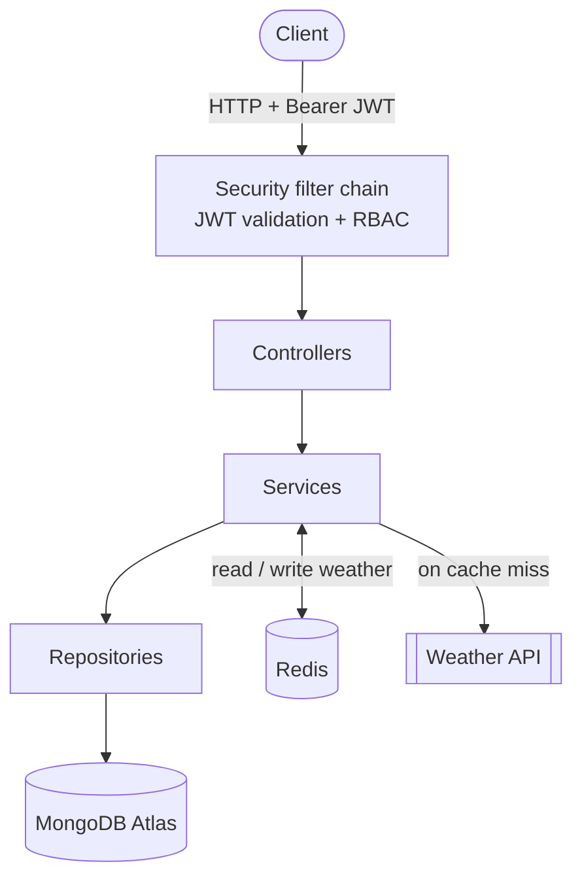
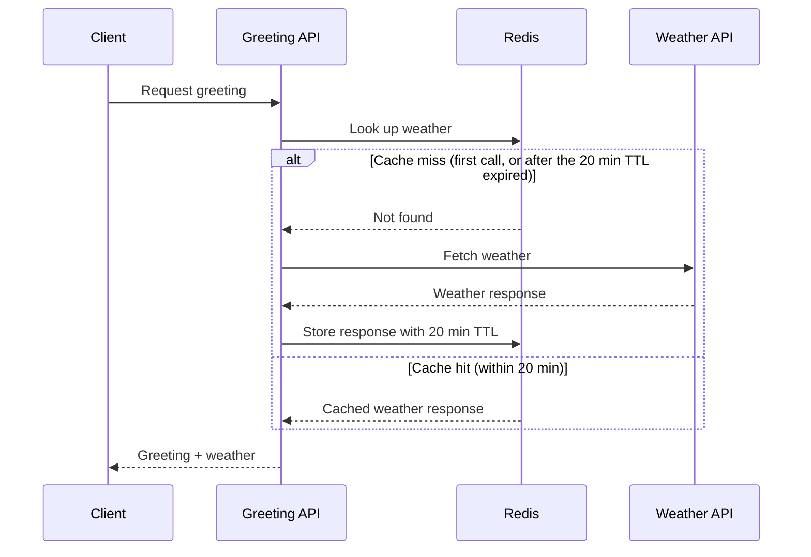
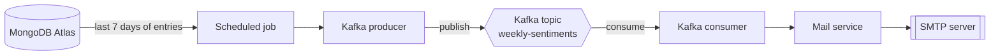

# 📓 JournalApp

A production-ready **Journal Management REST API** built with **Spring Boot 3**, **MongoDB**, **Spring Security + JWT**, **Redis** caching and **Apache Kafka** event-driven messaging. It follows a clean, layered architecture with automated testing and continuous code-quality analysis.


[](https://sonarcloud.io/summary/new_code?id=adityamathur456_journalapp)
[](https://sonarcloud.io/summary/new_code?id=adityamathur456_journalapp)
[](https://sonarcloud.io/summary/new_code?id=adityamathur456_journalapp)
[](https://sonarcloud.io/summary/new_code?id=adityamathur456_journalapp)
[](https://sonarcloud.io/summary/new_code?id=adityamathur456_journalapp)

---

## ✨ Features

- **Journal CRUD** – create, read, update and delete journal entries per user
- **Authentication & Authorization** – stateless JWT authentication with Spring Security
- **Role-Based Access Control** – `USER` and `ADMIN` roles
- **Redis caching** – external weather API responses cached with a 20-minute TTL to cut down on repeated calls
- **Kafka event-driven workflow** – sentiment-analysis email pipeline that processes a user's entries from roughly the last 7 days
- **Email notifications** – sent through Spring Mail
- **Request validation** – Bean Validation on incoming payloads
- **Testing** – unit tests with JUnit 5 and Mockito, plus integration tests
- **Code quality** – JaCoCo coverage reports analysed by SonarQube / SonarCloud
- **CI** – GitHub Actions workflows for build, test and analysis

---

## 🛠️ Tech Stack

| Layer            | Technology                                   |
| ---------------- | -------------------------------------------- |
| Language         | Java 21                                      |
| Framework        | Spring Boot 3.5.15                           |
| Database         | MongoDB Atlas (Spring Data MongoDB)          |
| Security         | Spring Security, JWT (`jjwt` 0.12.5)         |
| Caching          | Redis (Spring Data Redis)                    |
| Messaging        | Apache Kafka (Spring for Apache Kafka)       |
| Build tool       | Maven (with Maven Wrapper)                   |
| Boilerplate      | Lombok                                       |
| Testing          | JUnit 5, Mockito                             |
| Code quality     | JaCoCo, SonarCloud                           |
| CI/CD            | GitHub Actions                               |
| Containers       | Docker Compose (Kafka)                       |

---

## 🏗️ Architecture
 
The application has two independent flows: a synchronous **request path** for API calls and an asynchronous **sentiment workflow** driven by Kafka.
 
### 1. Request path
 

 
1. The client sends a request with a `Bearer` JWT. The security filter chain validates the token and checks the user's role (`USER` or `ADMIN`) before the request reaches a controller.
2. Controllers handle HTTP and validation, services hold the business logic, and repositories talk to MongoDB.
3. Weather data is cached in Redis. See the sequence below for exactly how the cache behaves.
#### Weather caching (greeting API)
 

 
- **First call:** nothing is cached, so the weather API is called, the response is stored in Redis and returned to the user.
- **Within 20 minutes:** the response is served straight from Redis and the weather API is not called.
- **After 20 minutes:** Redis automatically deletes the expired entry, so the next call is a cache miss. The weather API is called again, the fresh response is stored, and it is returned to the user.
### 2. Asynchronous sentiment workflow
 

 
1. A scheduled job collects each user's journal entries from roughly the last 7 days.
2. The result is published as an event to the `weekly-sentiments` Kafka topic.
3. A consumer picks up the event and the mail service emails the sentiment summary through SMTP, keeping this slow work off the request path.
---

The codebase is organised in layers (controller → service → repository) so that web, business and persistence concerns stay separate and are easy to test in isolation.

---

## 📋 Prerequisites

- **JDK 21**
- **Maven 3.9.15 (or use the bundled `./mvnw`)
- **MongoDB** – MongoDB Atlas cluster
- **Redis** – free tier 30mb
- **Docker & Docker Compose** – to run Kafka locally
- An SMTP account for outgoing email (e.g. Gmail app password)

---

## 🚀 Getting Started

### 1. Clone the repository

```bash
git clone https://github.com/adityamathur456/journalapp.git
cd journalapp
```

### 2. Start Kafka

The repository ships a `docker-compose.yml` that runs a single-node Kafka 4.0.1 broker in KRaft mode (no ZooKeeper) with 3 default partitions.

```bash
docker compose up -d
```

Kafka is then reachable at `localhost:9092`.

#### Create the Kafka topic

The sentiment-analysis workflow publishes to the `weekly-sentiments` topic. Create it inside the running container:

```bash
docker exec -it kafka-container /opt/kafka/bin/kafka-topics.sh --create \
  --topic weekly-sentiments \
  --bootstrap-server localhost:9092 \
  --partitions 3 \
  --replication-factor 1
```

#### Verify the topic

```bash
docker exec -it kafka-container /opt/kafka/bin/kafka-topics.sh --describe \
  --topic weekly-sentiments \
  --bootstrap-server localhost:9092
```

The output should show `PartitionCount: 3` and `ReplicationFactor: 1`.

### 3. Configure the application

Set your MongoDB, Redis, Kafka, mail and JWT settings in `src/main/resources/application.yml` (or `application.properties`). Keep secrets out of version control by using environment variables.

```yaml
spring:
  data:
    mongodb:
      uri: ${MONGODB_URI}
    redis:
      host: ${REDIS_HOST:localhost}
      port: ${REDIS_PORT:6379}
  kafka:
    bootstrap-servers: localhost:9092
  mail:
    host: smtp.gmail.com
    port: 587
    username: ${MAIL_USERNAME}
    password: ${MAIL_PASSWORD}
```

You will also need to supply a JWT signing secret and, if applicable, your weather API key, using the property names defined in your configuration.

### 4. Build and run

```bash
./mvnw clean install
./mvnw spring-boot:run
```

On Windows use `mvnw.cmd` instead of `./mvnw`.

The API starts on `http://localhost:8080` by default.

---

## 🔐 Authentication

The API uses **stateless JWT authentication**.

1. Register a user or log in to receive a token.
2. Send the token with every protected request:

```http
Authorization: Bearer <your-jwt-token>
```

| Role    | Access                                                   |
| ------- | -------------------------------------------------------- |
| `USER`  | Manage their own journal entries and profile             |
| `ADMIN` | Everything a user can do, plus administrative operations |

---

## 📡 API Overview

<!-- Adjust these paths to match your controllers. -->

| Area        | Method   | Endpoint                | Access        | Description                  |
| ----------- | -------- | ----------------------- | ------------- | ---------------------------- |
| Public      | `POST`   | `/public/signup`        | Public        | Register a new user          |
| Public      | `POST`   | `/public/login`         | Public        | Authenticate and get a JWT   |
| Journal     | `GET`    | `/journal`              | USER / ADMIN  | List the user's entries      |
| Journal     | `POST`   | `/journal`              | USER / ADMIN  | Create an entry              |
| Journal     | `GET`    | `/journal/id/{id}`      | USER / ADMIN  | Get an entry by id           |
| Journal     | `PUT`    | `/journal/id/{id}`      | USER / ADMIN  | Update an entry              |
| Journal     | `DELETE` | `/journal/id/{id}`      | USER / ADMIN  | Delete an entry              |
| User        | `GET`    | `/user`                 | USER / ADMIN  | Greeting / profile with weather |
| Admin       | `GET`    | `/admin/all-users`      | ADMIN         | List all users               |

---

## 🔄 Caching & Messaging

### Redis
Responses from the external weather API are cached in Redis with a **20-minute TTL**, so repeated requests inside that window are served from cache instead of hitting the third-party API.

### Kafka
Sentiment analysis runs as an asynchronous, event-driven workflow. A producer publishes the user's recent journal entries (about the last 7 days) to a Kafka topic, and a consumer processes them and sends the resulting sentiment summary by email. This keeps slow work off the request path.

---

## 🧪 Testing & Code Quality

Run the full test suite and generate the coverage report:

```bash
./mvnw clean verify
```

- Unit tests use **JUnit 5** and **Mockito**.
- Security paths are covered with **Spring Security Test**.
- **JaCoCo** writes its report to `target/site/jacoco/jacoco.xml`.
- That report is picked up by **SonarQube / SonarCloud** for coverage and quality analysis.

---

## ⚙️ CI/CD

GitHub Actions workflows (in `.github/workflows`) build the project, run the tests and push analysis results to SonarCloud on every change.

---

## ☁️ Deployment

The application is deployed on a **Google Cloud Platform VM**. Package it with:

```bash
./mvnw clean package -DskipTests
java -jar target/journalapp-0.0.1-SNAPSHOT.jar
```

Provide secrets (MongoDB URI, mail credentials, JWT secret, API keys) through environment variables on the server or local user variables in desktop, never in the repository.

---

## 🤝 Contributing

1. Fork the repository
2. Create a feature branch: `git checkout -b feature/my-feature`
3. Commit your changes: `git commit -m "Add my feature"`
4. Push the branch: `git push origin feature/my-feature`
5. Open a Pull Request

---

## 👤 Author

**Aditya Mathur** – [@adityamathur456](https://github.com/adityamathur456)

---

## 📄 License

This project is licensed under the terms of the license in the [LICENSE](LICENSE) file.
